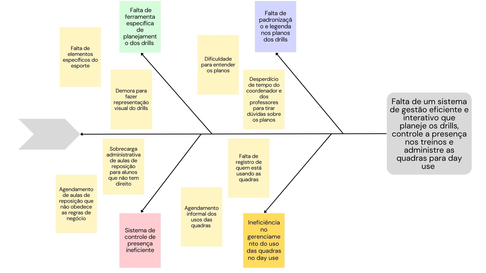

<h1 align="center"><b>VISÃO GERAL DO PRODUTO</b></h1>

## Histórico de Revisão

| **Data**   | **Versão** | **Descrição**                                              | **Autor**                                                                                                                                                                                                        |
| ---------- | ---------- | ---------------------------------------------------------- | ---------------------------------------------------------------------------------------------------------------------------------------------------------------------------------------------------------------- |
| 14/9/2023 | 0.1 | Criação do documento | [Victório Lázaro](https://github.com/Victor-oss) |
| 23/9/2023 | 0.2 | Corrigindo duplicidade no item "Objetivos do Produto"  | [Weslley Barros](https://github.com/weslley17w) |
| 24/9/2023 | 0.3 | Inserção das tecnologias e do diagrama de Ishikawa na Visão Geral do Produto | [Victório Lázaro](https://github.com/Victor-oss) |
| 24/10/2023 | 0.4 | Correção do Diagrama de Ishikawa e do Problema Principal | [Victório Lázaro](https://github.com/Victor-oss) |

## Problema

*Os desafios discutidos estão relacionados ao contexto de uma empresa que oferece aulas de Beach Tennis e aluga suas quadras para uso externo quando estas não estão em uso para as aulas regulares (day use). Conforme relatado em entrevista com o cliente, foram identificados quatro problemas principais.*

*O primeiro problema diz respeito ao uso de ferramentas inadequadas para planejamento dos drills (também conhecidos como treinos). Cada aula consiste em quatro tipos de drills: aquecimento, movimentação, jogo sem saque e jogo completo. Atualmente, o coordenador das aulas é responsável por elaborar manualmente os planos de aula com todos os drills, adaptando-os de acordo com o nível dos alunos (iniciante, intermediário ou avançado). Essa tarefa envolve a criação de representações visuais da quadra, incluindo a disposição dos alunos, as trajetórias das bolas, a divisão das linhas da quadra e os equipamentos necessários, como o cano alterado, o arco e o cone. Este processo de criação de drills consome um tempo significativo devido à utilização de ferramentas de edição de texto, como o Word. Como resultado, a elaboração das aulas é demorada e os elementos inseridos nos drills nem sempre representam os equipamentos das aulas de maneira intuitiva.*

*Um problema adicional decorrente do planejamento dos drills é a falta de padronização e legenda, o que leva a confusões entre os professores. Esses professores frequentemente precisam entrar em contato com o coordenador para esclarecer dúvidas, o que pode resultar em interferências e atrasos nas aulas.*

*O terceiro problema reportado diz respeito ao ineficiente sistema de controle de presença dos alunos usado atualmente pela empresa. A empresa utiliza um sistema de registro de faltas que automaticamente marca aulas de reposição para os alunos ausentes. No entanto, este sistema não leva em consideração as políticas da empresa, que exigem que as aulas de reposição sejam agendadas apenas se o aluno apresentar um atestado médico ou avisar com pelo menos vinte e quatro horas de antecedência. Isso tem resultado no registro de aulas de reposição para alunos que não atendem a esses requisitos, causando uma sobrecarga administrativa.*

*Outro problema é a informalidade no gerenciamento do fluxo de pessoas durante o "day-use" - o período em que as quadras não estão sendo usadas para aulas e podem ser utilizadas para jogos por alunos e público externo. Atualmente, não existe um controle desse processo. Isso inclui o controle de presença dos alunos durante o "day-use" e a falta de um registro claro sobre quais alunos ou pessoas externas estão usando as quadras. Além disso, o agendamento para o uso das quadras é realizado por meio de conversas via chat ou atendimento presencial, o que pode ser ineficiente e suscetível a erros.*

*Para se entender a causa principal, que causa todos os problemas citados, foi utilizada a técnica do Diagrama de Ishikawa (Espinha de Peixe). O problema se sustenta sobre a ineficiência no planejamento dos drills, controle de presença nos treinos e administração das quadras para day use. Através do Diagrama de Ishikawa, foram encontradas 4 causas raízes: Uso de ferramentas inadequadas para planejamento dos drills, Falta de padronização e legenda nos drills, Sistema de controle de presença ineficiente e Informalidade no agendamento do uso das quadras no day use. O diagrama feito pela equipe pode ser visualizado na figura 1.*

Figura 1 - Diagrama de Ishikawa do Problema

Fonte: Autores (2023)

## Declaração de Posição do Produto

*O Beach Tennis CoordiMate é uma ferramenta completa para planejamento, controle de presença e controle de uso de quadras esportivas para atender a gestão de uma arena de Beach Tennis.*

*Ao contrário de outras ferramentas, como o Microsoft Word para o planejamento de aulas e sistemas de controle de presença como o Sistema Pacto, o Beach Tennis CoordiMate foi desenvolvido especificamente para atender às necessidades únicas dos instrutores e organizadores de Beach Tennis. Ele não apenas automatiza tarefas, mas também oferece recursos avançados, como criação de drills, padronização de comunicações com professores, respeito às regras de negócio da empresa nas marcações de aulas de reposição e uma gestão eficiente do uso da quadras fora do período de aula. Nossa plataforma se destaca por integrar todas essas funcionalidades em uma única plataforma, proporcionando a você uma solução completa e eficaz.*

*Com o Beach Tennis CoordiMate, você economiza tempo valioso, reduz erros administrativos e, o mais importante, melhora a experiência de seus alunos. Isso torna todo o processo de organização mais organizado e eficaz, resultando em clientes satisfeitos e aulas bem-sucedidas. Toda essa descrição da aplicação está resumida na tabela 1.*

Tabela 1 - Declaração de Posição do Produto

<table>
  <tr>
    <td>Para</td>
    <td>Organizadores do Beach Tennis</td>
  </tr>
  <tr>
    <td>Quem</td>
    <td>Necessita de mais eficiência no gerenciamento de clientes</td>
  </tr>
  <tr>
    <td>O Beach Tennis CoordiMate</td>
    <td>É um aplicação web de planejamento e controle de presença de aulas de Beach Tennis, além de gerenciar o uso de quadras e também serve de ferramenta de comunicação entre o aluno e a empresa.</td>
  </tr>
  <tr>
    <td>Que</td>
    <td>Oferece uma maneira eficiente e conveniente de planejar e coordenar todas as atividades relacionadas às aulas de Beach Tennis, desde o planejamento dos drills até o controle de presença dos alunos. Com isso, você economiza tempo valioso, reduz erros administrativos e melhora a experiência de seus alunos, tornando o processo mais organizado e eficaz.</td>
  </tr>
  <tr>
    <td>Ao contrário</td>
    <td>Do Microsoft Word, para planejar aulas, e também o sistema de controle de presença em aulas de crossfit Sistema Pacto para controlar presença e que marca aulas sem permissão do usuário.</td>
  </tr>
  <tr>
    <td>Nosso produto</td>
    <td>Automatiza e integra várias tarefas em uma única plataforma. Ele oferece recursos avançados de criação de drills, padronização das comunicações com os professores, garantia de conformidade nas marcações de aulas de reposição e uma gestão eficiente do "day-use". Nenhuma outra solução oferece essa combinação de recursos em uma única plataforma.</td>
  </tr>
</table>

Fonte: Autores (2023)

## Objetivos do Produto

*O principal objetivo é facilitar o planejamento de aulas de Beach Tennis e administração de quadras. Os objetivos secundários são:*

- Padronizar e melhorar a comunicação entre coordenadores e professores, reduzindo conflitos e atrasos;
- Garantir a conformidade nas marcações de aulas de reposição, dando maior liberdade e controle para o usuário;
- Gerenciar eficientemente o fluxo de pessoas durante o "day-use", proporcionando uma experiência mais organizada e segura.

## Tecnologias a Serem Utilizadas
*Para o desenvolvimento do produto de software apresentado, a equipe utilizará as tecnologias listadas na tabela 2.*

Tabela 2 - Tecnologias a Serem Utilizadas

  <table>
    <thead> 
      <tr>
        <th>Categoria</th>
        <th>Tecnologia</th>
      </tr>
    </thead>
    <tbody>
      <tr>
        <td>Linguagem de programação</td> 
        <td>TypeScript, JavaScript</td>
      </tr>
        <td>Framework de frontend</td>
        <td>React</td>
      <tr>
        <td>Framework de backend </td>
        <td>PrismaORM, NodeJS</td>
      </tr>
      <tr>
        <td>Banco de dados</td>
        <td>PostgreSQL</td>
      </tr>
    </tbody> 
  </table>

Fonte: Autores (2023)

## Referências Bibliográficas

- Material da disciplina disponivel no aprender
