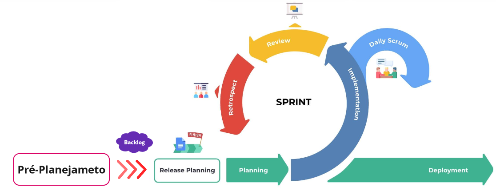

<h1 align="center"><b>PROCESSO DE DESENVOLVIMENTO DE SOFTWARE</b></h1>

## Histórico de Revisão

| **Data**  | **Versão** | **Descrição**        | **Autor**                                                     |
| --------- | ---------- | -------------------- | ------------------------------------------------------------- |
| 26/9/2023 | 0.1        | Criação do documento | [Luciano de Freitas](https://github.com/luciano-freitas-melo) |
| 26/9/2023 | 0.2        | Adiciona Abordagem, Ciclo de Vida e Processo | [Luciano de Freitas](https://github.com/luciano-freitas-melo) |
| 27/9/2023 | 0.3        | Insere as características do processo que serão desenvolvidos pela equipe| [Luciano de Freitas](https://github.com/luciano-freitas-melo) |
| 15/11/2023 | 0.4        | Revisão das características do processo | [Luciano de Freitas](https://github.com/luciano-freitas-melo) |

## Abordagem de Desenvolvimento do Software

  *Segundo Sommerville(2018)¹, para decidir sobre uma abordagem para o desenvolvimento de um software é necessário responder a uma série de perguntas, de três tipos diferentes:*
    
  1. **Questões técnicas** relacionadas ao sistema a ser desenvolvido
  2. **Questões humanas** relacionadas à equipe de desenvolvimento
  3. **Questões organizacionais** relacionadas ao contexto no qual o sistema será desenvolvido 

### Questões técnicas

1. **Qual é o tamanho do sistema que está sendo desenvolvido?**
   
    Um sistema de pequeno porte.

2. **Que tipo de sistema está sendo desenvolvido?**
   
    Uma aplicação web de complexidade média, com requisitos não muito bem definidos e que podem ser alterados durante o desenvolvimento.

3. **Qual é a vida útil prevista para o sistema?**
   
    A princípio, vida útil de curto a médio período.

4. **O sistema está sujeito a controle externo?**
   
    Sim, sujeito ao controle do cliente e do acompanhamento da disciplina.

### Questões humanas

1. **Qual é o nível de competência dos projetistas e programadores do time de desenvolvimento?**
   
    Os projetistas possuem conhecimento em áreas diversas do desenvolvimento de software.

2. **Como está organizado o time de desenvolvimento?**
   
    O time é pequeno, e apesar de terem papéis definidos, todos devem participar da maioria das atividades.

3. **Quais são as tecnologias disponíveis para apoiar o desenvolvimento do sistema?**
   
    Os escopo tecnológico do projeto está melhor descrito [nesta seção](1.visao-produto.md/#tecnologias-a-serem-utilizadas).

### Questões organizacionais

1. **É importante ter uma especificação e um projeto (design) bem detalhados antes de passar para a implementação — talvez por motivos contratuais?**
   
    Não, existem partes da aplicação que podem ser resolvidos sem especificações de design.

2. **É realista uma estratégia de entrega incremental, na qual o software é entregue aos clientes ou outros stakeholders e um rápido feedback é obtido?**
   
    Sim, pois dessa forma é possível corrigir os problemas por partes, antes de uma implementação completa do projeto, a qual poderia comprometer todo o produto.

3. **Os representantes do cliente estarão disponíveis e dispostos a participar do time de desenvolvimento?**
   
    Não, os representantes do cliente participarão apenas no envio de feedbacks durante as fases de construção, não participando do desenvolvimento em si.

4. **Existem questões culturais que possam afetar o desenvolvimento do sistema?**
   
    Não, pois o time é novo e não tem apego a determinado método de desenvolvimento. 

### Conclusões

*Levando em consideração as respostas das questões acima e outros fatores elencados pela equipe, foi decidido que a abordagem de desenvolvimento do software será a* **Abordagem Ágil***, pelos seguintes critérios:*

- Complexidade ainda não mensurada e imprevisível das funcionalidades do sistema;
- Proximidade com o cliente e a possibilidade de feedbacks rápidos, além de não ser necessário uma formalização acentuada dos requisitos e do projeto como um todo;
- Time de desenvolvimento pequeno para um sistema de pequeno porte para um projeto de ciclo curto/médio;

## Ciclo de Vida e Processo de Desenvolvimento do Software

*Como a abordagem de desenvolvimento escolhida foi a Abordagem Ágil, o ciclo de vida do software será o* **Ciclo de Vida Ágil***, pois o desenvolvimento do software será feito em incrementos, com entregas parciais e contínuas, com o objetivo de atender as necessidades do cliente e se favorecer da disponibilidade de feedbacks constantes.*

*O processo de desenvolvimento do software será o* **Scrum/XP***, que a união de duas metodologias complementares: O Scrum e o eXtreme Programming (XP). A metodologia Scrum servirá para organização e adaptação da equipe de desenvolvimento durante o projeto, o XP servirá para a execução das atividades de desenvolvimento do software.*

*A escolha desse processo de software tem o objetivo de gerar uma melhor adaptação do projeto a mudanças de requisitos e de escopo, além de potencializar a participação do cliente por meio dos feedbacks constantes, todas características identificadas no projeto em questão.*

## Características e Adaptações do Processo Escolhido

### Scrum
*Todos os rituais e artefatos do Scrum que serão utilizados no projeto estão descritos na tabela 1, logo abaixo, seguindo as definições do The Scrum Guide(2020)².*

Tabela 1 - Características do Scrum a serem trabalhadas no projeto

| **Rituais/Artefatos**    | **Descrição**                                                                                                                                                                                                                |
|:------------------------:|:----------------------------------------------------------------------------------------------------------------------------------------------------------------------------------------------------------------------------:|
| Sprints                  | As sprints terão duração de 1 semana, sempre iniciando e finalizando aos sábados.                                                                                                                          |
| Sprint Planning          | As plannings ocorrerão sempre aos sábados no início da sprint através de reuniões síncronas. Para critérios de simplificação, a Sprint Planning será incorporada a Release Planning do XP.                                                                               |
| Daily Scrum              | Serão feitas de forma assíncrona todos os dias pela equipe de desenvolvimento no decorrer da sprint.                                                                                                                         |
| Sprint Retrospective     | As Retrospectives serão realizadas as quartas-feiras, por conta de disponibilidade da equipe.  |
| Sprint Review            | A review da sprint ocorrerá no último dia da Sprint, aos sábados, antes do início da próxima Planning.                                                                                                                                                          |
| Product Backlog          | O Backlog será utilizado para elencar e estruturar o conjunto inicial de requisitos do projeto e será utilizado ao longo do projeto para novos requisitos encontrados.                                                                                                                              |
| Sprint Backlog           | Esse artefato servirá para definir os requisitos que serão desenvolvidos e entregues para a próxima release.                                                                 |
| Definition Of Done (DoD) | Esse compromisso do Scrum será utilizado para verificar e validar que os incrementos fazem sentido para o produto.                                                                                                                           |

Fonte: Autores (2023)

### eXtreme Programming (XP)

*As características do XP que serão utilizadas no projeto estão descritas na tabela 2, seguindo as informações fornecidas por Don Wells(2013)³ sobre eXtreme Programming.*

Tabela 2 - Características do XP a serem trabalhadas no projeto

| Característica | Descrição |
|:---:|:---:|
| User Stories (US) | As US serão a principal fonte de requisitos do projeto e auxiliaram para estimar os prazos para as entregas das funcionalidade do produto. |
| Release Planning | A Release Planning servirá para definir o Backlog da Sprint de quais US serão implementadas. Devido ao espoco da disciplina de Requisitos as releases serão planejadas por prazos (by date). Além disso, a Sprint Planning do Scrum será englobada pela Release Planning por critérios de simplificação. |
| Velocity Tracking | Tanto na Release Planning, como na Iteration Planning será utilizado o Velocity Tracking para auxiliar na definição dos prazos e nas estimativas de entrega das funcionalidades. |
| Planning Poker | Método para avaliação das histórias e consentimento acerca da US.  |
| Sustainable, Measurable, Predictable Pace | O ritmo da equipe será avaliado durante todas as etapas de projeto, principalmente através do Velocity Tracking e das Retrospectives do Scrum. |
| Stand up Meetings | Serão incorporadas as dailys do Scrum, com o propósito de responder as seguintes perguntas: O que foi feito ontem?; O que será tentado hoje?; e Quais problemas estão causando atrasos? |
| Pair programming e Move people around | O Pair Programming servirá para melhoria na qualidade do produto, além de compartilhamento de experiência pela equipe. Para isso, o Move People Around também será muito útil, pois fará com que toda a equipe esteja capacitada em todas as áreas do produto. |

Fonte: Autores (2023)

### Organização das sprints

*A organização das sprints levou em conta as características escolhidas para cada processo, a disponibilidade do cliente e da equipe do projeto, bem como as características da disciplina de requisitos. Foi estabelecido uma etapa anterior aos ciclos do Scrum/XP, chamado de* **Pré-planejamento***, em que será estruturado o backlog inicial do produto utilizando as atividades de engenharia de requisitos, melhor descritos [nesse artefato](./4.processo-requisitos.md). A figura 1 abaixo mostra de forma visual a organização das sprints do projeto.*

Figura 1 - Organização das sprints do projeto

Fonte: Autores (2023)

## Referências Bibliográficas

1. Sommerville, Ian Engenharia de software/ Ian Sommerville; tradução Luiz Cláudio Queiroz; revisão técnica Fábio Levy Siqueira. 10. ed. São Paulo: Pearson Education do Brasil, 2018. Título original: Software engineering ISBN 978-65-5011-048-2 1. Engenharia de software I. Siqueira.
2. The 2020 Scrum Guide TM. Scrum Guides, 2020. Disponível no [link](https://scrumguides.org/scrum-guide.html#purpose-of-the-scrum-guide). Acesso em: 27 de setembro de 2023.
3. WELLS, Don. Extreme Programming: A gentle introduction. Extreme Programming, 2013. Disponível no [link](http://www.extremeprogramming.org/). Acesso em: 27 de setembro de 2023.
