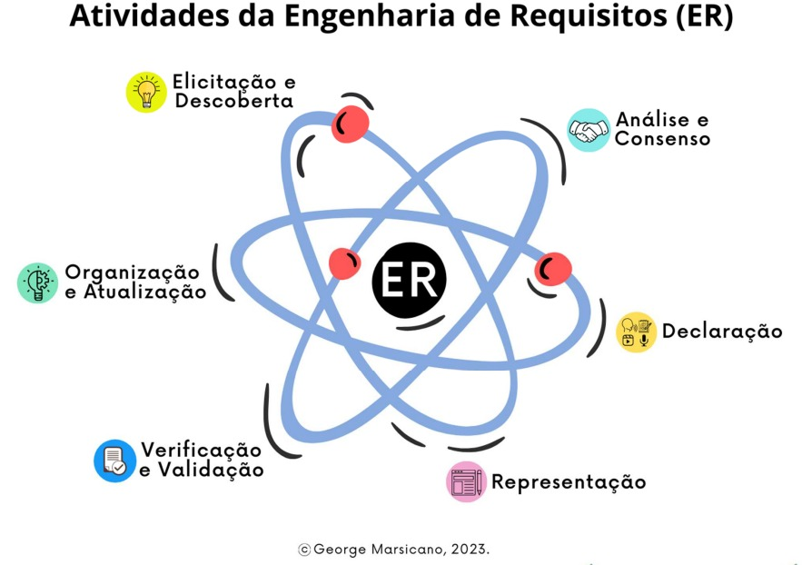
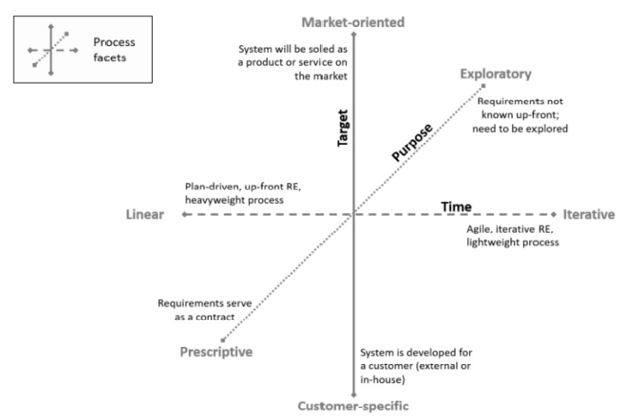

<h1 align="center"><b>PROCESSO DE ENGENHARIA DE REQUISITOS</b></h1>

## Histórico de Revisão

| **Data**  | **Versão** | **Descrição**        | **Autor**                                                     |
| --------- | ---------- | -------------------- | ------------------------------------------------------------- |
| 26/9/2023 | 0.1 | Criação do documento | [Luciano de Freitas](https://github.com/luciano-freitas-melo) |
| 26/9/2023 | 0.2 | Documentação dos processos de Engenharia de Requisitos | [Artur Rodrigues](https://github.com/ArturRSA19) e [João Barreto](https://github.com/JoaoBarreto03)|
| 27/9/2023 | 0.3 | Refatoração e correção da documentação dos processos de Engenharia de Requisitos | [Artur Rodrigues](https://github.com/ArturRSA19), [João Barreto](https://github.com/JoaoBarreto03) e [Luciano de Freitas](https://github.com/luciano-freitas-melo)|

## Processos de Engenharia de Requisitos

*Segundo [MARSICANO (2023)¹](#referencias-bibliograficas), o Processo de Engenharia de Requisitos define quais são as etapas essenciais para a construção de um software, sendo aplicado em metodologias ágeis ou em processos dirigidos a plano. A Figura 1 mostra as atividades pertencentes à ER:*

Figura 1 - Atividades da Engenharia de Requisitos

Fonte: MARSICANO, George (2023)

*No desenvolvimento do projeto, utilizam-se o Scrum e o XP (Extreme Programming) que são duas metodologias ágeis populares para o desenvolvimento de software. Embora o Scrum se concentre principalmente na gestão de projetos ágeis e no planejamento de sprints, e o XP coloque uma ênfase maior em práticas de engenharia de software, ambos os métodos têm abordagens específicas para a engenharia de requisitos. A seguir serão descritos os processos de Engenharia de Requisitos nos rituais do Scrum/XP:*

### Scrum

*Os processos da metodologia Scrum que serão utilizados durante o desenvolvimento do projeto serão:*

- Product Backlog - Este processo é responsável por manter os requisitos do projeto em uma evolução constante e atribuir uma prioridade maior aos requisitos mais importantes, permitindo ajustes durante o desenvolvimento do produto a cada Sprint.
- Sprint Backlog - Com esse processo, é possível planejar quais requisitos deverão ser trabalhados naquela iteração, além de permitir o acompanhamento dos requisitos que já foram concluídos ou que estão em andamento.
- Definition of Done (DoD) - Esse processo é crucial para garantir que os requisitos sejam implementados de forma adequada e completa. Ela estabelece os critérios que um incremento de trabalho deve atender para ser considerado pronto para entrega. Isso ajuda a garantir que os requisitos tenham sido atendidos completamente e que o trabalho tenha alta qualidade.

### Extreme Programing (XP)

*No XP, os processos de Engenharia de Requisitos utilizados serão:*

- User Story (US) - Este processo auxilia na compreensão dos requisitos do projeto e pode ser utilizado para rastrear o ponto de desenvolvimento em que a equipe se encontra, a medida que as histórias são concluídas. Além disso, este processo pode ser muito utilizado no quesito de recebimento do Feedback do cliente a cada entrega, permitindo a atualização e melhoria dos requisitos.  
- Tasks - Desempenham um papel importante no desenvolviemtno de software ágil. As Tasks são basicamente subdivisôes de itens do Product Backlog que descrevem o trabalho específico necessário para implementar um requisito. As Tasks estão relacionadas com à Engenharia de Requisitos justamente pela sua capacidade de detalhamento de requisitos, atribuição de trabalho, acompanhamento de progresso além da sinalização da conclusão de requisitos.  

## Facetas do processo

*Uma vez que definidas as tarefas da Engenharia de Requisitos, é necessário estabelecer uma abordagem ou procedimento para realizá-las. No Handbook for the CPRE Foundation Level according to the IREB Standard, publicado pelo International Requirements Engineering Board (IREB), é apresentado um método para definir um processo de Engenharia de Requisitos com base na análise das diversas dimensões desse processo. É preciso analisar quais características extremas de cada aspecto se relacionam com o conhecimento atual e as expectativas em relação ao produto a ser desenvolvido. Com base nessa análise, juntamente com as definições previamente estabelecidas sobre o ciclo de vida e o processo de desenvolvimento de software, é possível estabelecer um processo a ser seguido para a execução das atividades de Engenharia de Requisitos. A **Figura 2** ilustra as diferentes dimensões desse processo:*

Figura 2 - Facetas da Engenharia de Requisitos.
 

Fonte: Handbook IREB CPRE Foundation Level, 2022

*A partir da descrição das facetas, é possível definir qual o melhor processo a ser utilizado no processo, sendo então escolhido o modelo Participativo, que engloba as facetas: iterativo, exploratório e cliente específico. Essa escolha foi baseada nos seguintes requisitos:*

- O projeto será desenvolvido em etapas de curto ciclo com um feedback contínuo por parte do cliente;
- Os requisitos do projeto não são totalmente conhecidos no início, havendo a necessidade de explorá-los ao longo de seu desenvolvimento;
- O projeto está sendo feito para atender às necessidades de um cliente específico. Logo, a participação do mesmo é de extrema importância no desenvolvimento do produto.

## Ferramentas

*As ferramentas foram selecionadas de modo a facilitar a comunicação entre os membros da equipe e alavancar, na medida do possível, a produtividade e criatividade. Nesse sentido, as ferramentas são as seguintes, listadas na **Tabela 1**:*

Tabela 1 - Ferramentas utilizadas no projeto.
 

Logo | Ferramenta | Finalidade |
|---|---|---|
|  | Discord | Realizar as Sprints e Dailies |
|  | Google Chrome | Ferramenta de pesquisa e estudos |
| | Github e Gitpages | Armazenar e apresentar a documentação do projeto, bem como o código-fonte do produto |
|  | Microsoft Teams | Realizar as reuniões semanais e gravar os vídeos das apresentações |
|  | Mkdocs | Criação do template da github pages |
|  | VSCode | Programação e edição da github pages |
|  | WhatsApp | Manter a comunicação entre os integrantes |
|  | Youtube | Compartilhar apresentações e disponibilizar as reuniões semanais |

Fonte: Autores, 2023

## Atividades de Engenharia de Requisitos

*As **tabelas 2 a 5** mostram a relação entre as atividades do Processo de Engenharia de Requisitos, os métodos do Scrum e do XP utilizados, as ferramentas necessárias e a definição do que será entregue naquela etapa.*

### Sprint Planning e Release Planning

Tabela 2 -  Processos da Engenharia de Requisitos (ER) envolvidos na Sprint Planning e Release Planning

| Atividades | Métodos | Ferramentas | Entrega
| --- | --- | --- | ---
| Elicitação e descoberta | User Story, Brainstorming e Observação | Microsoft Teams, Discord, Whatsapp e Google Chrome | Conjunto de User Story, lista de necessidades e Visão de Produto
| Análise e consenso | User Story Mapping | Microsoft Teams, Discord, Whatsapp e GitHub | User Stories priorizadas e funcionalidades que serão entregues na release.

Fonte: Autores, 2023

### Sprint

Tabela 3 -  Processos de ER envolvidos na Sprint

| Atividades | Métodos | Ferramentas | Entrega
| --- | --- | --- | ---
| Validação e Verificação | Definition of Done (DoD), Revisão e Testes | Discord, Github e Whatsapp| DoD, Resultado da revisão, testes aceitos e passando
| Organização e atualização | User Story Mapping | Discord, Github e Whatsapp| Mapa das User Story

Fonte: Autores, 2023

### Sprint Review

Tabela 4 -  Processos de ER envolvidos na Sprint Review

| Atividades | Métodos | Ferramentas | Entrega
| --- | --- | --- | ---
| Verificação e Validação | Product Backlog | Microsoft Teams, Discord, Whatsapp e GitHub | Revisão das atividades e do feedback gerado pelo cliente
| Organização e atualização | Definition of Done (DoD), Revisão e Testes | Discord, Github e Whatsapp| DoD, Resultado da revisão, testes aceitos e passando

Fonte: Autores, 2023

### Interation Planning

Tabela 5 -  Processos de ER envolvidos na Interation Planning

| Atividades | Métodos | Ferramentas | Entrega
| --- | --- | --- | ---
| Elicitação de Requisitos | Entrevistas com o Cliente, Revisão de Documentação Existente | Microsoft Teams, Discord, Whatsapp | Lista de Requisitos Priorizados para a Iteração |

Fonte: Autores, 2023

## Referências Bibliográficas

1. Material da disciplina disponivel no aprender
