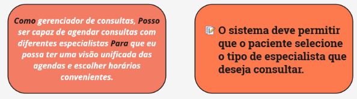
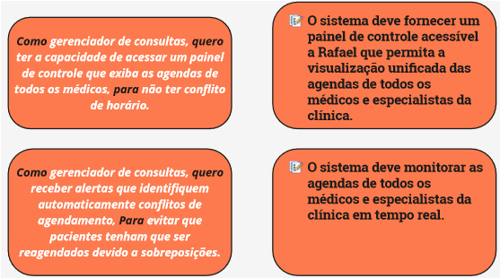
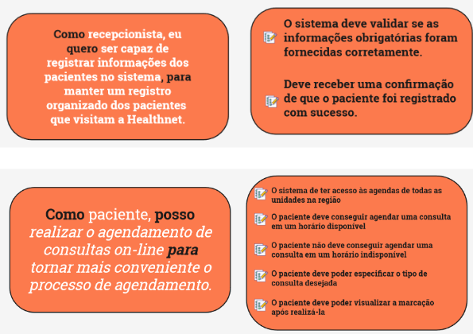
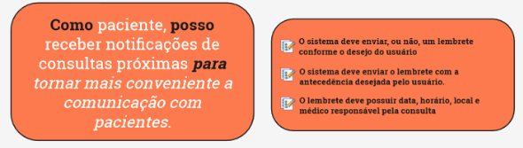
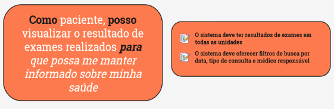
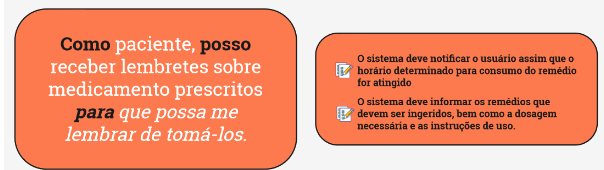
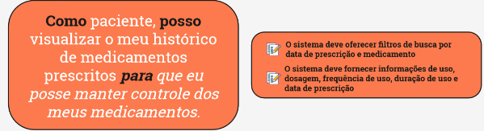

# Ver&Val - Critérios de Aceitação

| **Data** | **Versão** | **Descrição** | **Autor** |
| -------- | ---------- | ------------- | --------- |
|     22/11/2023      |      0.1      | Criação do documento              | Artur |

Somente esse critério não é suficiente para compreender e validar essa US.
 
Faltaram critérios relacionados a:  
    - quais infos tem em uma consulta a ser agendada  
    - quando é possível ou não agendar uma consulta  
    - como deve ser feita o agendamento dessas consultas  
O critério apresentado precisa trazer informações de quais são os tipos de especialistas.

A história parece ser muito grande, acho que seria interessante quebrar em duas histórias: uma relacionada a acessar a lista de pacientes da clínica ou algo do tipo, e outra relacionada a acessar o histórico de um paciente.  
Pouquíssimos critérios de aceitação para a história  
Tem que ter critérios relacionados a como o gerenciador consegue:  
- selecionar um paciente para visualizar o histórico dele  
- quais as infos exatas que serão mostradas nesse histórico  
- o que tem nesse resumo das consultas  

Essas duas US seguem no mesmo modelo das outras duas apresentadas anteriormente

Que informações o paciente coloca para realizar a consulta?  
quais tipos de consulta ele pode especificar?  
Trocaria “visualizar a marcação” por ter uma confirmação que a consulta foi marcada  

_O critério 3 e 4 são bem legais, pois mostra quando é possível e não é possível realizar a ação._

Nos critérios 1 e 2 eu trocaria a visão para ser a do paciente, como:  
“O paciente deve ser capaz de selecionar se deseja receber notificações”  
“O paciente deve ser capaz de selecionar o tempo de antecedência para receber a notificação”  

Mesma coisa da outra US, seria melhor ter a visão do ator da US do que do sistema.  
Não dá pra saber o que terá no resultado do exame, como por exemplo:  
tem a prescrição do médico? tem algum medicamento que deve ser tomado? tem algum exame a ser feito? é só a confirmação que a consulta foi feita?

Quais as regras para o paciente receber uma notificação?  
ele tem o poder de não querer receber o lembrete?  
como que esses lembretes são gerados? é a partir da prescrição do médico?  

Quais informações têm no prontuário?  
O filtro por data em relação ao que?  

Acho legal deixar claro que as infos do critério 2 está relacionado a cada medicamento do histórico  
Poderia ter um critério para dizer quais informações têm nesse histórico, podendo, por exemplo, quebrar o critério 1 em dois.

