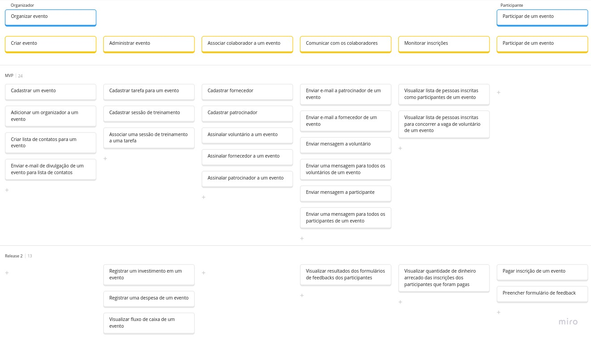
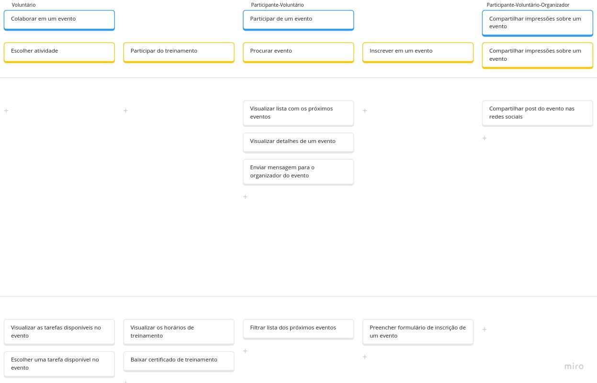

# User Story Mapping

| **Data**   | **Versão** | **Descrição**        | **Autor**              |
| ---------- | ---------- | -------------------- | ---------------------- |
| 20/11/2023 | 0.1        | Criação do documento | Artur, João e Victório |
| 22/11/2023 | 0.2        | Atualização da USM   | Victório               |

Neste tópico será apresentado o User Story Mappping da ComunEventos.

## O que é a ComunEventos?

A ComunEventos é uma empresa que possui como missão desenvolver uma plataforma online para otimizar a organização e promoção de eventos comunitários, permitindo que seus membros se reúnam em eventos que visem os interesses de ambos.

## Problemas a serem resolvidos

O intuito da plataforma é resolver problemas organizacionais de eventos comunitários, sendo os principais:

- Utilização de múltiplas ferramentas, nem sempre projetadas para eventos, o que dificulta a organização e sobrecarrega os membros, que precisam criar e divulgar o evento e comunicar com os participantes.
- Orçamento baixo para contratação de plataformas especializadas para eventos.
- Falta de uma plataforma simplificada e unificada para a realização de todas as etapas da inscrição dos participantes em um único lugar.
- Dificuldades no processo de colaboração com os membros que acontece de forma física ou por canais de comunicação, nem sempre padronizados, prejudicando os organizadores que nem sempre conseguem acessar todas as solicitações recebidas.

## Benefícios

A implementação dessa plataforma acarreta em inúmeros benefícios, como:

- Integração das ferramentas utilizadas pela ComunEventos em uma única plataforma
- Diminuição dos custos de contratação de plataformas de eventos, uma vez que elas serão dispensadas
- Melhoria no engajamento com os participantes
- Incentivo a colaboração local, com parcerias e voluntários, devido a facilitação do processo
- Incentivo a realização de eventos que atendam as diversas necessidades

## Para quem?

Os beneficiados por essa plataforma seriam:

- Organizadores
- Participantes
- Fornecedores locais
- Patrocinadores
- Voluntários

## USM construído

Abaixo, está apresentado o USM proposto para a resolução do problema. As fotos em melhor qualidade podem ser acessadas clicando em [USM - Parte 1](../../assets/USMComunEventos.jpg) e [USM - Parte 2](../../assets/USMComunEventos2.jpg)

As histórias de usuário extraídas do USM estão registradas na tabela a seguir:

| **US** | **Enunciado**                                                                                                                                                                                                                                                                           |
| ------ | --------------------------------------------------------------------------------------------------------------------------------------------------------------------------------------------------------------------------------------------------------------------------------------- |
| US01   | Eu, como Organizador, desejo cadastrar um evento para ter um registro dos eventos que eu organizo                                                                                                                                                                                       |
| US02   | Eu, como Organizador, desejo adicionar um organizador a um evento que os outros organizadores do evento possam participar da gerência desse evento pelo sistema                                                                                                                         |
| US03   | Eu, como Organizador, desejo criar lista de contato para um evento para registrar os possíveis contatos que podem ter interesse em ajudar o evento                                                                                                                                      |
| US04   | Eu, como Organizador, desejo enviar e-mail de divulgação de um evento para lista de contatos para divulgar o evento aos que podem querer ajudá-lo                                                                                                                                       |
| US05   | Eu, como Organizador, desejo cadastrar tarefa para um evento para ter um registro de todas as tarefas que precisam ser feitas antes e durante a realização do evento                                                                                                                    |
| US06   | Eu, como Organizador, desejo cadastrar sessão de treinamento para ter um registro das sessões de treinamento necessárias para realização de certas tarefas um evento                                                                                                                    |
| US07   | Eu, como Organizador, desejo associar uma sessão de treinamento a uma tarefa para categorizar cada sessão de treinamento pela tarefa que ela capacita o voluntário a realizar                                                                                                           |
| US08   | Eu, como Organizador, desejo cadastrar fornecedor para ter um registro dos fornecedores de um evento que pode fornecer para meus eventos                                                                                                                                                |
| US09   | Eu, como Organizador, desejo cadastrar patrocinador para ter um registro de um patrocinador que pode patrocinar meus eventos                                                                                                                                                            |
| US10   | Eu, como Organizador, desejo assinalar voluntário a um evento para distribuir de forma organizada as pessoas aprovadas para serem voluntários entre meus eventos                                                                                                                        |
| US11   | Eu, como Organizador, desejo assinalar fornecedor a um evento para fazer o registro de um fornecedor confirmado do meu evento                                                                                                                                                           |
| US12   | Eu, como Organizador, desejo assinalar patrocinador a um evento para fazer o registro de um patrocinador confirmado do meu evento                                                                                                                                                       |
| US13   | Eu, como Organizador, desejo enviar e-mail a patrocinador de um evento para conseguir enviar alinhamentos sobre o evento na mesma plataforma que gerencio o evento                                                                                                                      |
| US14   | Eu, como Organizador, desejo enviar e-mail a fornecedor de um evento para conseguir enviar alinhamentos sobre o evento na mesma plataforma que gerencio o evento                                                                                                                        |
| US15   | Eu, como Organizador, desejo enviar mensagem a voluntário para fazer alinhamentos específicos com um certo voluntário                                                                                                                                                                   |
| US16   | Eu, como Organizador, desejo enviar uma mensagem para todos os voluntários de um evento para fazer comunicados gerais para todos os voluntários de um evento facilmente                                                                                                                 |
| US17   | Eu, como Organizador, desejo enviar mensagem a participante para fazer alinhamentos específicos com um certo participante                                                                                                                                                               |
| US18   | Eu, como Organizador, desejo enviar uma mensagem para todos os participantes de um evento para fazer comunicados gerais para todos os participantes de um evento facilmente                                                                                                             |
| US19   | Eu, como Organizador, desejo visualizar lista de pessoas inscritas como participantes de um evento para monitorar a quantidade de participantes inscritos de um evento                                                                                                                  |
| US20   | Eu, como Organizador, desejo visualizar lista de pessoas inscritas para concorrer a vaga de voluntário de um evento para monitorar a quantidade de pessoas com interesse em se voluntariar a um evento                                                                                  |
| US21   | Eu, como Participante-Voluntário, desejo visualizar lista com os próximos eventos para verificar se existe algum evento que eu tenha interesse de participar como Participante ou Voluntário                                                                                            |
| US22   | Eu, como Participante-Voluntário, desejo visualizar detalhes de um evento para ter acesso a mais detalhes de um evento pelo qual eu tenho interesse                                                                                                                                     |
| US23   | Eu, como Participante-Voluntário, desejo enviar mensagem para o organizador do evento para tirar dúvidas sobre o evento                                                                                                                                                                 |
| US24   | Eu, como Participante-Voluntário-Organizador, desejo compartilhar post do evento nas redes sociais para divulgar o evento ou compartilhar minha experiência no evento                                                                                                                   |
| US25   | Eu, como Organizador, desejo registrar um investimento em um evento para monitorar a entrada de dinheiro no evento                                                                                                                                                                      |
| US26   | Eu, como Organizador, desejo registrar uma despesa de um evento para monitorar os gastos do evento                                                                                                                                                                                      |
| US27   | Eu, como Organizador, desejo visualizar fluxo de caixa de um evento para monitorar a situação financeira do meu evento                                                                                                                                                                  |
| US28   | Eu, como Organizador, desejo visualizar resultados dos formulários de feedbacks dos participantes para conseguir visualizar o nível de satisfação dos participantes com o evento e ver o que pode melhorar                                                                              |
| US29   | Eu, como Organizador, desejo visualizar quantidade de dinheiro arrecado das inscrições dos participantes que foram pagas para monitorar o dinheiro arrecadado com as inscrições de participantes                                                                                        |
| US30   | Eu, como Participante, desejo pagar inscrição em de um evento para confirmar minha inscrição nos eventos que exigem pagamentos                                                                                                                                                          |
| US31   | Eu, como Participante, desejo preencher formulário de feedback para poder informar diretamente aos organizadores do evento meus elogios e críticas ao evento                                                                                                                            |
| US32   | Eu, como Voluntário, desejo visualizar as tarefas disponíveis no evento para poder escolher qual delas eu desejo realizar                                                                                                                                                               |
| US33   | Eu, como Voluntário, desejo escolher uma tarefas disponível no evento para que eu possa assumir a responsabilidade por uma tarefa que quero realizar antes ou durante o evento                                                                                                          |
| US34   | Eu, como Voluntário, desejo visualizar os horários de treinamento para que possa planejar meu tempo de acordo com os treinos que devo realizar para me capacitar para uma tarefa                                                                                                        |
| US35   | Eu, como Voluntário, desejo baixar certificado de treinamento para que eu possa ter um certificado da minha capacitação para determinada tarefa                                                                                                                                         |
| US36   | Eu, como Participante-Voluntário, desejo filtrar lista dos próximos eventos para que eu possa encontrar eventos que me interessam facilmente                                                                                                                                            |
| US37   | Eu, como Participante-Voluntário, desejo preencher formulário de inscrição de um evento para que possa comprar um ingresso para um evento que desejo ser participante ou fornecer informações para os organizadores avaliarem se vão me chamar para um evento que desejo me voluntariar |

