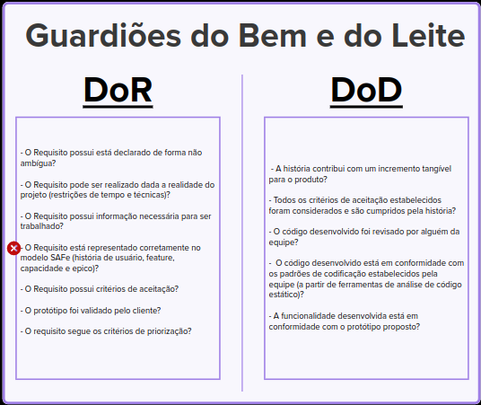

# Ver&Val DoR & DoD - Facção GBL

| **Data**   | **Versão** | **Descrição**        | **Autor** |
| ---------- | ---------- | -------------------- | --------- |
| 22/11/2023 | 0.1        | Criação do documento | Victório  |

# Definition Of Ready (DoR)

## Verificação:

- Ter mais verificações a respeito das histórias e menos sobre os requisitos, pois o DoR vai ser aplicado principalmente a nível de US.
- As US devem ser verificadas se estão declaradas de forma correta (pode ser utilizada alguma técnica, como o INVEST ou DEEP)
- Quem possui critérios de aceite são as histórias, acho que é interessante deixar isso claro

## Validação:

- É interessante ter uma validação mais objetiva dos requisitos em relação ao prazo e entendimento da equipe
- Quais são os critérios de priorização?
- Os critérios de aceite também devem ser validados com o cliente

# Definition Of Done (DoD)

## Verificação:

- Tudo em conformidade

## Validação:

- Como avaliar que é um incremento tangível para o produto? Acho que pode ser mais objetivo

# Conclusão

Dada as considerações, o critérios para o DoR e DoD foram feitos de maneira correta.
