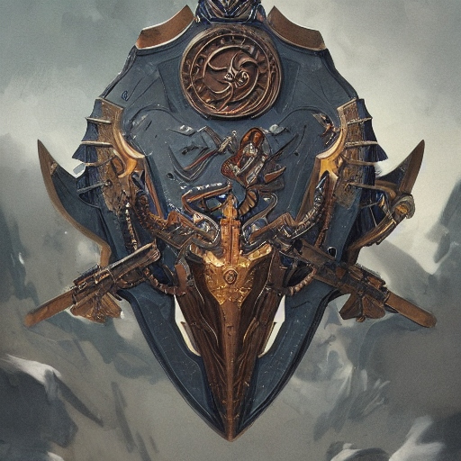

| **Data** | **Versão** | **Descrição** | **Autor** |
| -------- | ---------- | ------------- | --------- |
|     08/11/2023      |      0.1      | Criação do documento              | Victório        |

# Facção "Guardiões da Galáxia"

## Membros
- Cowboy Intergaláctico (João)
- Defensor Cósmico (Artur)
- Helios Nebularis (Weslley)
- Lu’lu (Luciano)
- Markus (Pablo)
- Victrum Lazariano (Victório)

## História dos Membros
1) Cowboy Intergalático

Meu nome é João Barreto, mais conhecido como Cowboy Intergalático, e eu sou um dos membros mais leais da facção intergaláctica Guardiões da Galáxia. Desde que me juntei a esse grupo, tenho dedicado minha vida para proteger a galáxia de ameaças que poucos ousam enfrentar. Com um estilo de vida que mistura adrenalina e harmonia.

Sou uma pessoa única nesse universo, diferente de tudo e diferente de todos, apaixonado por carros. Sou um aficionado por eles. Seja pilotando uma nave de alta velocidade ou dirigindo um veículo terrestre em um planeta distante, estou sempre no comando das máquinas mais impressionantes que posso encontrar. Mas não é só a velocidade que me move, também é a música. E o meu estilo musical favorito? Sertanejo, sem dúvidas. Não importa onde esteja, sempre tenho um violão ou algum dispositivo que toque as melhores músicas sertanejas.

Minha combinação de paixões pode parecer estranha para alguns, mas é isso que me faz ser quem sou e que me encoraja a entrar nessa jornada perigosa.

2) Defensor Cósmico

Me chamo Artur, um alienígena de um planeta distante, sou mais conhecido como Defensor Cósmico, um dos Guardiões da Galáxia. Eu sempre fui apaixonado por futebol e música, mas minha vida mudou para sempre quando meu planeta foi atacado por uma facção de alienígenas cruéis, Slitherium. Eu fui o único sobrevivente, e fui forçado a fugir para o espaço.

Após perder tudo, encontrei os Guardiões da Galáxia, que me acolheram e me ensinaram a usar meus poderes para proteger a galáxia. Hoje, sou um Guardião orgulhoso, determinado a lutar por justiça e igualdade para todos os seres vivos.

Ainda tenho tempo para aproveitar meus hobbies, pois eles me ajudam a relaxar e a me sentir feliz. Afinal, essas são as coisas que me tornam quem eu sou.

3) Helios Nebularis

Helios Nebularis é um Guardião destemido e ambicioso na galáxia caótica de Calamum Caeruleum. Ele se destaca dos outros Guardiões por afirmar que tinha vivido em um multiverso chamado 2023.1, embora suas memórias fossem fragmentadas. Helios compartilhava suas experiências desse multiverso, inspirando outros Guardiões com suas visões de tecnologia avançada e desafios semelhantes aos que enfrentavam. 

Sua ambição o impulsiona a encontrar formas inovadoras de proteger raças em risco de extinção e restaurar a ordem em planetas devastados pela ganância corporativa. Helios usava sua suposta conexão com o multiverso para desenvolver estratégias únicas e abordagens fora do comum.

4) Lu’lu

Eu sou Lu'lu, e minha história começa em um lugar distante da galáxia. Quando eu era apenas um jovem alienígena, fazia parte de uma civilização antiga e religiosa, dedicada a ajudar os necessitados e praticar o bem. Mas um dia, a escuridão da ganância corporativa recaiu sobre nós. O Grupo Spark Tech, sob a fachada de inovação tecnológica, destruiu nossa civilização em busca de segredos ancestrais. Eu fui o único sobrevivente, uma pequena luz de esperança em meio à escuridão que eles trouxeram. Mas minha força de vontade e minha crença inabalável no bem me guiaram para um novo propósito.

Foi assim que eu encontrei os Guardiões da Galáxia, um grupo de pessoas com o mesmo desejo ardente de trazer paz e bondade para nossa galáxia. Juntos, juramos lutar contra as forças da ganância e da exploração desenfreada. Estamos determinados a enfrentar o Grupo Spark Tech e outras corporações gananciosas que ameaçam a harmonia da galáxia. Afinal, não importa o quão sombrio o cenário possa parecer, sempre haverá espaço para a luz e o bem prevalecerem. E eu estou aqui para garantir que isso aconteça."

5) Markus

Markus viveu em um planeta devastado por uma corporação gananciosa(apache). Ele perdeu sua família e sua comunidade na destruição. Ele se refugiou nos estudos e na pesquisa, aprendendo sobre as civilizações antigas e a ecologia dos planetas.
Sendo um intelectual e pesquisador habilidoso. Ele sabe muito sobre os estragos das corporações e como proteger a natureza e as comunidades vulneráveis. Ele é um estrategista e planejador excelente. Ele fornece análises e informações cruciais para as missões dos Guardiões.
Markus quer proteger o que é precioso em sua galáxia. Ele acredita que seu conhecimento é uma arma poderosa contra as corporações. Ele também quer superar sua timidez e se tornar uma voz mais forte na luta pela justiça.

6) Victrum Lazariano

Victrum Lazariano nasceu no planeta deserto Capivarian-3 (rico em recursos minerais). Seu povo foi escravizado pela Slitherium e foram forçados a trabalhar nas minas. Uma operação massiva de mineração culminou em uma catástrofe que contaminou irreparavelmente o ambiente de Capivarian-3. 

Conseguiu fugir em uma nave da Slitherium, só que não conseguiu salvar sua família. Por anos, estudou táticas de guerrilha, aprendeu a pilotar naves espaciais e dominou a arte da diplomacia. Se juntou à facção dos Guardiões da Galáxia, que compartilhava seu objetivo de justiça e proteção dos vulneráveis na galáxia Calamum Caeruleum. 

## Jornada dos Guardiões da Galáxia

No coração da galáxia Calamum Caeruleum, onde a ganância das corporações e o caos imperavam, os destinos de seis indivíduos destemidos se cruzaram. Conhecidos como os Guardiões da Galáxia, eles eram uma facção comprometida com a justiça e a solidariedade. Defensor Cósmico, Cowboy Intergaláctico, Lu'lu, Victrum Lazariano, Helios Nebularis e Markus cada um com suas habilidades únicas e motivações pessoais, foram reunidos pelo Comandante Estelar Marsicano para formar uma coalizão contra as forças da tirania corporativa. Unidos por um propósito nobre, eles estavam prontos para enfrentar a batalha que definiria o destino da galáxia, promovendo a esperança onde antes só havia desespero.

## Conclusão

Os Guardiões da Galáxia são uma facção composta por vários sobreviventes das ações tirânicas do conglomerado e por isso os membros sabem o perigo da ganância do conglomerado.

A facção se compromete à:

- Lutar contra a tirania corporativa
- Instaurar a ordem na galáxia por meio da solidariedade e justiça.
- Acatar ao Comando Estelar e ao Comandante Estelar Marsicano
- Promover a esperança
	
