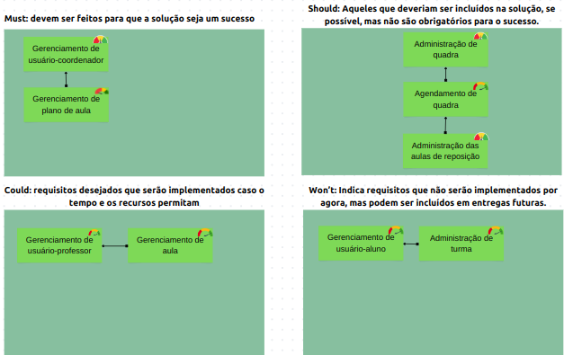

## Histórico de Revisão

| **Data** | **Versão** | **Descrição** | **Autor** |
| -------- | ---------- | ------------- | --------- |
|     25/10/2023      |      0.1      | Criação do documento              |  Artur, João, Luciano, Pablo, Victório e Weslley        |

## Mínimo Produto Viável

A metodologia utilizada para a escolha do nosso MPV foi a Matriz de Priorização. Essa técnica permite classificar os requisitos do produto com base em critérios específicos. Na matriz apresentada, foram utilizadas três dimensões para avaliar cada Feature: a perspectiva de negócios, o entendimento técnico e as dependências. 

Na dimensão de perspectiva de negócio foi utilizada a técnica MoSCoW, em que as funcionalidades foram divididas em 4 quadrantes, que são MUST, SHOULD, COULD e WON'T.

O entendimento técnico foi a avaliação da visão da equipe da facilidade de implementação da funcionalidade e da capacidade da equipe para o desenvolvimento da mesma. Para isso, foi utilizado 3 classificações que estão relacionadas ao nível de entendimento e pode ser BAIXO, MEDIANO e ALTO.

Outro critério para estruturar as funcionalidades foi as dependências entre as funcionalidades. As dependências entre funcionalidades foram avaliadas caso a caso para cada uma das funcionalidades do produto, levando em consideração o entendimento da equipe das relações entre cada funcionalidade e do escopo do projeto. Para referenciar as dependências , foram usadas setas na figura 1 em que, por exemplo, uma seta cuja extremidade reta está em uma funcionalidade A e a ponta da seta aponta para uma funcionalidade B significa que A depende de B.

**Pontuações** 

**Perspectiva de Negócio**

- MUST: maior valor e devem fazer parte da solução
- SHOULD: tem valor e podem fazer parte da solução 
- COULD: tem algum valor e seriam desejáveis para o produto
- WON'T: pouco valor e que não serão desenvolvidos no momento

**Entendimento Técnico:**

- BAIXO
- MEDIANO
- ALTO 

**Dependência**
- Número da Feature do qual ela depende
- '-' caso ela não dependa de nenhuma feature

| **FEATURE** | **Perspectiva de Negócio** | **Entendimento Técnico** | **Dependência** |
| :---------: | :------------------------: | :----------------------: | :-------------: |
|     F1      |            MUST            |         MEDIANO          |        -        |
|     F2      |           COULD            |           ALTO           |        -        |
|     F3      |           WON'T            |           ALTO           |        -        |
|     F4      |           WON'T            |           ALTO           |       F3        |
|     F5      |           SHOULD           |         MEDIANO          |       F7        |
|     F6      |           SHOULD           |         MEDIANO          |        -        |
|     F7      |           SHOULD           |           ALTO           |       F6        |
|     F8      |            MUST            |          BAIXO           |       F8        |
|     F9      |           COULD            |           ALTO           |       F2        |

Figura 1 - Priorização do Backlog

Fonte: Autores (2023)

## Proposta do MPV

 &emsp;&emsp;
  A partir da priorização das funcionalidades da aplicação, a equipe fez as seguintes observações para a definição do MPV 

1. As funcionalidades que estão no MUST devem estar todas incluídas no MPV, pois é a principal dor para o cliente e deve estar na solução do produto.
2. A funcionalidade F8 tem um risco alto para o projeto, já que a equipe tem um baixo entendimento técnico dessa feature, mas será desenvolvida por conta do seu altíssimo valor de negócio.
3. Por conta do item 2, foi definido que somente uma funcionalidade do SHOULD será desenvolvida no MPV1, e por conta das dependências notadas, essa funcionalidade será a F6

|                 **MPV**                 |
| :---------------------------------------: |
| F1 - Gerenciamento de usuário-coordenador |
|       F6 - Administração de quadras       |
|    F8 - Gerenciamento de plano de aula    |

## Alinhamento do MPV aos objetivos do projeto

Dado os objetivos do projeto estabelecidos no [documento de visão do produto](https://mdsreq-fga-unb.github.io/2023-2-BeachTennisCoordiMate/doc-visao/1.visao-produto/), é possível visualizar como o MPV se alinha a esses objetivos:

* As funcionalidades F1 e F8 estão diretamente relacionadas ao objetivo de planejamento das aulas de beach tennis, que buscam resolver o problema da falta de uma ferramenta para criação dos drills e padronização dos planos de aulas.
* Além disso, a funcionalidade F6 está relacionada ao objetivo de administração das quadras de beach tennis, que busca iniciar a resolução do problema de fluxo de pessoas durante o day-use com a estruturação do funcionamento das quadras físicas por meio do produto.

## User Stories do MPV

A partir das funcionalidades priorizadas com o MoSCoW, foram definidas, consequentemente, as User Stories que estarão contidas no MVP. A tabela abaixo apresenta essas User Stories:

 | **Funcionalidade** | **US** |                                  **Descrição**                                  |
 | :----------------: | :----: | :-----------------------------------------------------------------------------: |
|         F1         |  US01  |                                                        Eu, como usuário-coordenador, desejo criar minha conta para administrar a arena                                                        |
|         F1         |  US02  |                                   Eu, como usuário-coordenador, desejo fazer login na minha conta para acessar as funcionalidades exclusivas de coordenador   
|         F6         |  US34  |                                     Eu, como usuário-coordenador, desejo criar uma quadra com uma identificação para gerenciar as quadras do meu negócio                                      |
|         F6         |  US35  |                                                 Eu, como usuário-coordenador, desejo excluir uma quadra para caso essa quadra seja desativada                                                 |
|         F6         |  US36  |                                                 Eu, como usuário-coordenador, desejo editar as informações de uma quadra para corrigir erros                                                  |
|         F6         |  US37  |                                         Eu, como usuário-coordenador, desejo visualizar uma quadra, para procurar por erros nas informações da quadra                                         |
|         F6         |  US38  |               Eu, como usuário-coordenador, desejo definir o status de uma quadra em determinado dia e horário, para notificar quando ela está livre ou quando ela será limpa.                |
|         F6         |  US39  |           Eu, como usuário-coordenador, desejo visualizar os status de uma quadra em um mês na forma de agenda, para observar quando ela está livre, está tendo aula ou será limpa.           |
|         F6         |  US40  |                      Eu, como usuário-coordenador, desejo editar o status de uma quadra em determinado dia e horário, para quando ocorrer mudanças no uso dessas quadras                      |
|         F6         |  US41  |                                Eu, como usuário-coordenador, desejo visualizar uma lista com todas as quadras, para saber a quantidade de quadras cadastradas                                 |
|         F8         |  US50  |                            Eu, como usuário-coordenador, desejo criar um plano de aula com título e os objetivos da aula, para poder administrar as aulas da arena                            |
|         F8         |  US51  |                                           Eu, como usuário-coordenador, desejo poder visualizar um plano de aula, para procurar por possíveis erros                                           |
|         F8         |  US52  |                                    Eu, como usuário-coordenador, desejo poder excluir um plano de aula, para apagar planos de aula que estiverem obsoletos                                    |
|         F8         |  US53  |                          Eu, como usuário-coordenador, desejo poder editar um plano de aula, para alterar planos de aula que estiverem com alguma informação errada                           |
|         F8         |  US54  |                Eu, como usuário-coordenador, desejo baixar os planos de aulas, para conseguir enviá-los aos responsáveis pela verificação dos planos, que são externos a arena                |
|         F8         |  US55  |                     Eu, como usuário-coordenador, desejo adicionar um ou mais drills a um plano de aula para declarar os diferentes drills presentes em um plano de aula                      |
|         F8         |  US56  |                                                  Eu, como usuário-coordenador, desejo criar um drill para representar e registrar um treino                                                   |
|         F8         |  US57  |                                    Eu, como usuário-coordenador, desejo adicionar personagens ao drill para representar os alunos em um exercício/circuito                                    |
|         F8         |  US58  |                               Eu, como usuário-coordenador, desejo adicionar equipamentos a um drill para representar os equipamentos de um exercício/circuito                                |
|         F8         |  US59  |                                  Eu, como usuário-coordenador, desejo deletar equipamentos de um drill para deletar um equipamento adicionado  erroneamente                                   |
|         F8         |  US60  |                                  Eu, como usuário-coordenador, desejo deletar personagens de um drill para deletar um personagem adicionado um  erroneamente                                  |
|         F8         |  US61  |                                   Eu, como usuário-coordenador, desejo adicionar observações ao drill para detalhar mais um exercício/circuito de uma aula                                    |
|         F8         |  US62  |                                 Eu, como usuário-coordenador, desejo deletar observações de um drill para deletar uma observação  adicionado uma erroneamente                                 |
|         F8         |  US63  |                                                  Eu, como usuário-coordenador, desejo editar as observações de um drill para corrigir erros                                                   |
|         F8         |  US64  |                                      Eu, como usuário-coordenador, desejo deletar um drill obsoleto para não deixar drills obsoletos em um plano de aula                                      |
|         F8         |  US65  |                                                 Eu, como usuário-coordenador, desejo editar as informações de um drill para corrigir um erro                                                  |
|         F8         |  US66  |                                 Eu, como usuário-coordenador, desejo atribuir planos de aula a professores para informar a eles sobre como as aulas devem ser                                 |
|         F8         |  US67  |                            Eu, como usuário-coordenador, desejo visualizar uma lista com todos os planos de aula para ter uma noção da quantidade de planos feitos                            |
|         F8         |  US68  |                   Eu, como usuário-coordenador, desejo visualizar uma lista com todos os drills de um plano de aula para ter uma noção da quantidade de drills nesse plano                    |
|         F8         |  US69  |                        Eu, como usuário-professor, desejo visualizar os planos de aula que me forem atribuídos para ter uma orientação de como devem ser minhas aulas                         |

