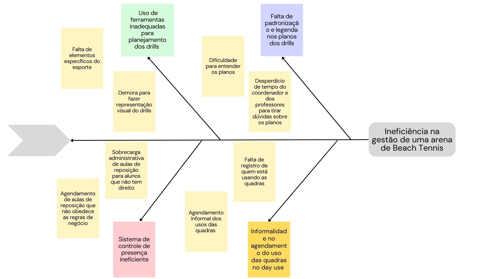

<h1 align="center"><b>VISÃO DO PRODUTO E PROJETO</b></h1>

## Histórico de Revisão

| **Data**   | **Versão** | **Descrição**                                              | **Autor**                                                                                                                                                                                                        |
| ---------- | ---------- | ---------------------------------------------------------- | ---------------------------------------------------------------------------------------------------------------------------------------------------------------------------------------------------------------- |
| 14/9/2023 | 0.1 | Criação do documento | [Victório Lázaro](https://github.com/Victor-oss)  |
| 23/9/2023 | 0.2 | Corrigindo duplicidade no item 1.3  | [Weslley Barros](https://github.com/weslley17w)  |

## 1 VISÃO GERAL DO PRODUTO

### 1.1 Problema

*Os desafios discutidos estão relacionados ao contexto de uma empresa que oferece aulas de Beach Tennis e aluga suas quadras para uso externo quando estas não estão em uso para as aulas regulares (day use). Conforme relatado em entrevista com o cliente, foram identificados quatro problemas principais.*

*O primeiro problema diz respeito ao planejamento dos drills (também conhecidos como treinos). Cada aula consiste em quatro tipos de drills: aquecimento, movimentação, jogo sem saque e jogo completo. Atualmente, o coordenador das aulas é responsável por elaborar manualmente os planos para cada drill de cada aula, adaptando-os de acordo com o nível dos alunos (iniciante, intermediário ou avançado). Essa tarefa envolve a criação de representações visuais da quadra, incluindo a disposição dos alunos, as trajetórias das bolas, a divisão das linhas da quadra e os equipamentos necessários, como o cano alterado, o arco e o cone. Este processo de criação de drills consome um tempo significativo devido à utilização de ferramentas de edição de texto, como o Word. Como resultado, a elaboração das aulas é demorada.*

*Um problema adicional decorrente do planejamento dos drills é a falta de padronização e legenda, o que leva a confusões entre os professores. Esses professores frequentemente precisam entrar em contato com o coordenador para esclarecer dúvidas, o que pode resultar em interferências e atrasos nas aulas.*

*O terceiro problema reportado diz respeito ao controle de presença dos alunos. A empresa utiliza um sistema de registro de faltas que automaticamente marca aulas de reposição para os alunos ausentes. No entanto, este sistema não leva em consideração as políticas da empresa, que exigem que as aulas de reposição sejam agendadas apenas se o aluno apresentar um atestado médico ou avisar com pelo menos vinte e quatro horas de antecedência. Isso tem resultado no registro de aulas de reposição para alunos que não atendem a esses requisitos, causando uma sobrecarga administrativa.*

*Outro desafio ocorre no gerenciamento do fluxo de pessoas durante o "day-use" - o período em que as quadras não estão sendo usadas para aulas e podem ser utilizadas para jogos por alunos e público externo. Atualmente, não existe um sistema de gestão eficiente para controlar esse processo. Isso inclui o controle de presença dos alunos durante o "day-use" e a falta de um registro claro sobre quais alunos ou pessoas externas estão usando as quadras. Além disso, o agendamento para o uso das quadras é realizado por meio de conversas via chat ou atendimento presencial, o que pode ser ineficiente e suscetível a erros.*

*Para se entender a causa principal, que causa todos os problemas citados, foi utilizada a técnica do Diagrama de Ishikawa (Espinha de Peixe). O problema se sustenta sobre a falta de um sistema de gestão eficiente e interativo que planeje os drills, controle a presença nos treinos e administre as quadras para day use. Através do Diagrama de Ishikawa, foram encontradas 4 causas raízes: Falta de ferramenta específica de planejamento dos drills, falta de padronização e legenda nos planos dos drills, sistema de controle de presença ineficiente e ineficiência no gerenciamento do uso das quadras no day use .*

### 1.2 Declaração de Posição do Produto
<table>
  <tr>
    <td>Para</td>
    <td>Organizadores do Beach Tennis</td>
  </tr>
  <tr>
    <td>Quem</td>
    <td>Necessita de mais eficiência no gerenciamento de clientes</td>
  </tr>
  <tr>
    <td>O Beach Tennis CoordiMate</td>
    <td>É um aplicativo de planejamento e controle de presença de aulas de Beach Tennis, além de gerenciar o uso de quadras e também serve de ferramenta de comunicação entre o aluno e a empresa.</td>
  </tr>
  <tr>
    <td>Que</td>
    <td>Oferece uma maneira eficiente e conveniente de planejar e coordenar todas as atividades relacionadas às aulas de Beach Tennis, desde o planejamento dos drills até o controle de presença dos alunos. Com isso, você economiza tempo valioso, reduz erros administrativos e melhora a experiência de seus alunos, tornando o processo mais organizado e eficaz.</td>
  </tr>
  <tr>
    <td>Ao contrário</td>
    <td>Do Microsoft Word, para planejar aulas, e também o sistema de controle de presença em aulas de crossfit Sistema Pacto para controlar presença e que marca aulas sem permissão do usuário.</td>
  </tr>
  <tr>
    <td>Nosso produto</td>
    <td>Automatiza e integra várias tarefas em uma única plataforma. Ele oferece recursos avançados de criação de drills, padronização das comunicações com os professores, garantia de conformidade nas marcações de aulas de reposição e uma gestão eficiente do "day-use". Nenhuma outra solução oferece essa combinação de recursos em um único aplicativo.</td>
  </tr>
</table>

### 1.2 Objetivos do Produto

*O principal objetivo é facilitar o planejamento de aulas de Beach Tennis e administração de quadras. Os objetivos secundários são:*

- Padronizar e melhorar a comunicação entre coordenadores e professores, reduzindo conflitos e atrasos;
- Garantir a conformidade nas marcações de aulas de reposição, dando maior liberdade e controle para o usuário;
- Gerenciar eficientemente o fluxo de pessoas durante o "day-use", proporcionando uma experiência mais organizada e segura.

### 1.3 Tecnologias a Serem Utilizadas

| Categoria | Tecnologia |
| ----- | ---- |
| Linguagem de programação | TypeScript, JavaScript |
| Framework de frontend | React |
| Banco de dados | PostgreSQL |

## 2 VISÃO GERAL DO PROJETO

### 2.1 Organização do Projeto

### 2.2 Planejamento das Fases e/ou Iterações do Projeto

### 2.3 Matriz de Comunicação

### 2.4 Gerenciamento de Riscos

### 2.5 Critérios de Replanejamento

## 3 PROCESSO DE DESENVOLVIMENTO DE SOFTWARE

## 4 LIÇÕES APRENDIDAS

## 4.1 Unidade 1

## 4.1 Unidade 2

## 4.2 Unidade 3

## 4.3 Unidade 4

## 5 REFERÊNCIAS BIBLIOGRÁFICAS

- Material da disciplina disponivel no aprender
